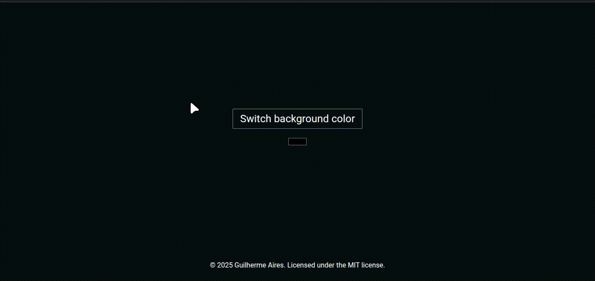

[](/license.txt)

## Table of contents
- [How to use](#how-to-use)
- [Demo](#demo)
- [Technologies](#technologies)
- [Functionality](#functionality)
- [Support](#support)
- [License](#license)

# Background color switcher [🔝](#table-of-contents)

A simple web app that let's you switch, or choose, the page's background color with a click, or choose a custom one.

## Functionality

- Clean interface
- Switch the page's background to a random color with each click or select a custom one

## Demo
[]()

## How to use

Clicking the button on the middle of the screen will change the background to a random color.
The input below it allows for a custom color to be used.

## How to locally run the project

1. Clone the repository.
```bash
git clone https://github.com/irmaodoguilherme/background-color-switcher.git
```

2. Navigate to the project's folder.
```bash
cd background-color-switcher
```

3. Run it locally using LiveServer in VSCode.

> Alternative: Double click the `index.html` file.

## Technologies

- JavaScript
- HTML
- CSS

## Support [🔝](#table-of-contents)
You can contact me through [contatoguilherme83@gmail.com](mailto:contatoguilherme83@gmail.com).

I accept any recommendations regarding the application. I'd be happy to add a little piece of every new idea so another person could study it.

Any found bugs can and should be reported through the `issues` section.

## License [🔝](#table-of-contents)

This project is licensed under the [MIT License](/license.txt)